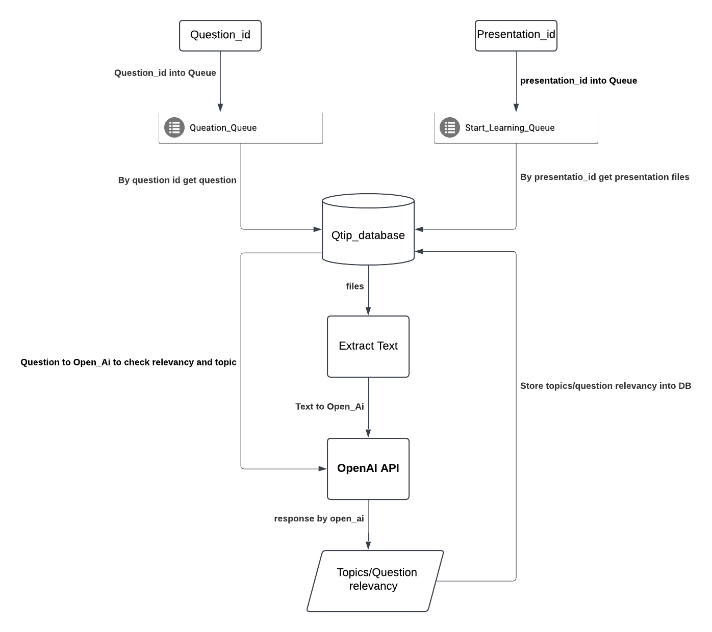

```bash
qtip-python-api[app]
├── rabbitMQ-sender(optional)
│   ├── Question.py
│   └── Start_learning.py
├── RMQ_Consumers
│   ├── assets
│   ├── packages
│   ├── __init__.py
│   ├── database.py
│   ├── extractFileText.py
│   ├── openai_api.py
│   ├── Quesion_Queue.py
│   └── Start_learning_queue.py
├── RMQ_venv
├── project_flow.png
├── README.md
└── requirements.txt
```


**About Folders:**

rabbitMQ-sender: Present queue initializers & add message into Queue as sender.

RMQ_Consumers: Present, packages, db, openapi, textExtract and Question, start_learning_Queues.

RMQ_venv: Present virtual environment setup.


**About files:**

database.py: In the file build connection with db and functions to perform get, put and update operation.

textExtract.py: Present functions to extract text from different kind of files.

openai_api.py: Open_api called in this file and get response on request

Question_Queue.py: Setup RabbitMQ Question consumer and made open_api, and db functon calls to perform get, update operations.

Start_Learning_Queue.py: Setup RabbitMQ Start_Learning consumer and made open_api, and db functon calls to perform get, post operations.




